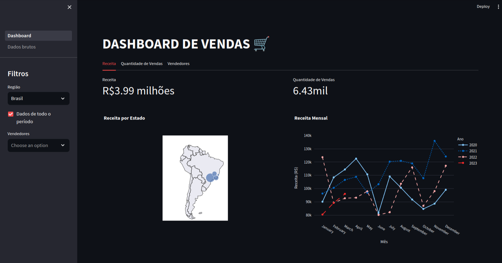

<hr>

# Dashboard Vendas

Bem-vindo ao Dashboard Vendas! 🚀 Este é um repositório dedicado ao projeto Dashboard Vendas. Projeto realizado como exercício de análise de dados utilizando python e plotly.

## Descrição

Dashboard Vendas é uma aplicação web que recria a interface de uma tabela com estatísticas de maiores vendedores podendo ser filtrada por estados. Este repositório contém o código-fonte e os arquivos essenciais para executar a aplicação em sua máquina local.

## Funcionalidades Principais

- 🌐 Recriação de Dashboard de Estatísticas de Vendas
- 📚 Recursos Interativos
- 💻 Ambiente de Desenvolvimento Integrado (IDE)

## Instruções de Instalação

Siga estas etapas para configurar o Dashboard Vendas em sua máquina:

1. **Clone o Repositório:**

   ```bash
   git clone https://github.com/devbdallagnol/sales_report_st
   ```

2. **Crie o ambiente virtual:**

   ```bash
   python -m venv venv && source venv/bin/activate
   ```

3. **Instale os pacotes:**

   ```bash
   pip install streamlit plotly requests
   ```

4. **Rode a aplicação:**

   ```bash
   streamlit run Dashboard.py
   ```

### Contribuição

Contribuições são bem-vindas! Se você deseja melhorar o projeto, siga estas diretrizes:

1. Faça um Fork do projeto
2. Crie uma nova branch `git checkout -b feature/nova-feature`
3. Faça commit das suas alterações `git commit -am 'Adiciona nova feature'`
4. Faça push para a branch `git push origin feature/nova-feature`
5. Abra um Pull Request

### Contato

Se precisar de ajuda ou tiver alguma dúvida, sinta-se à vontade para entrar em contato:

Desenvolvedor: @devbdallagnol
